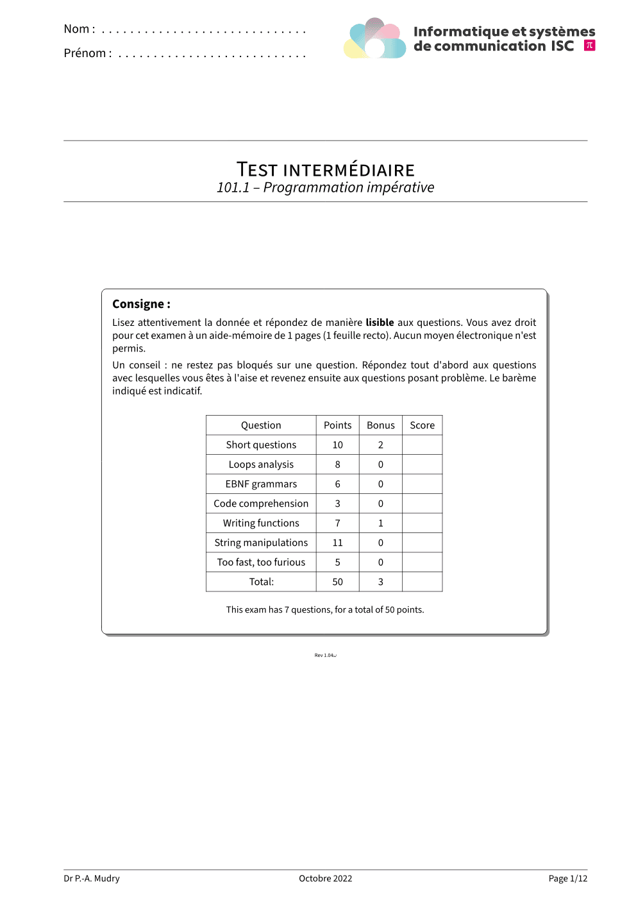

<picture>
  <source media="(prefers-color-scheme: dark)"
          srcset="https://raw.githubusercontent.com/ISC-HEI/isc-logos/main/white/ISC%20Logo%20inline%20white%20v3%20-%20large.webp">
  
</picture>

[](https://github.com/ISC-HEI/isc-hei-exam/actions/workflows/ci.yml)
[](https://typst.app/universe/package/isc-hei-exam)
[](https://github.com/ISC-HEI/isc-hei-exam/blob/main/LICENSE)

# isc-hei-exam — written exams and exercise series

The [Typst](https://typst.app/) template for written exams and exercise series of the [ISC degree programme](https://isc.hevs.ch/) at the School of Engineering in Sion. It is a one-to-one port of the ISC LaTeX exam template (Philip Hirschhorn's `exam` class plus the ISC `options.tex` used since 2009): same page geometry, same cover, same question numbering, points in the margin, grade table computed from the document, dotted answer spaces, MCQ and true/false rows, framed listings, and the same two PDFs out of one source: the exam handed to the students and the one with the solutions. The layout was calibrated page for page against the LaTeX renders, and a 14-page real exam comes out with the identical pagination.

## Preview

| Cover | Questions | Solutions |
|:---:|:---:|:---:|
| <a href="https://github.com/ISC-HEI/isc-hei-exam/blob/main/examples/exam.pdf?raw=true"></a> | <a href="https://github.com/ISC-HEI/isc-hei-exam/blob/main/examples/exam.pdf?raw=true">exam.pdf</a> — 12 pages, the student version | <a href="https://github.com/ISC-HEI/isc-hei-exam/blob/main/examples/exam-sol.pdf?raw=true">exam-sol.pdf</a> — the same source with the answers |

The series flavour: [`series.pdf`](https://github.com/ISC-HEI/isc-hei-exam/blob/main/examples/series.pdf?raw=true) and [`series-sol.pdf`](https://github.com/ISC-HEI/isc-hei-exam/blob/main/examples/series-sol.pdf?raw=true).

## Features

- **Exams that count themselves** — points given to parts and subparts are summed into the question headings, the cover grade table and the total sentence, by `query()`, never by hand
- **One source, two PDFs** — `typst compile --input solutions=true` prints the solutions in framed boxes where the students get dotted lines, and nothing else moves
- **The exam.cls look** — two-sided geometry with a binding offset, date and small-caps title alternating in the running header, HES-SO logo and page numbers swapping sides, "The end" on the last page
- **Answer spaces** — dotted lines, ruled lines, empty boxes, answer lines, with `1fr` for LaTeX's `\fill`
- **Choices** — square checkboxes, inline or stacked, and true/false rows with the dashed hairlines
- **Listings** — grey rounded frames with line numbers outside, the IntelliJ-like palette of the LaTeX `listings` setup, small and unframed variants
- **Series mode** — `series.with(...)` switches to the exercise-series geometry, header and title block
- **Trilingual UI strings** — French (reproducing the historical template, English boilerplate included), English and German, overridable per document

## Quick Start

```bash
# In the Typst web app: start a new project from the isc-hei-exam template.
# Locally: create a project from the template …
typst init @preview/isc-hei-exam
cd isc-hei-exam

# … then compile the student version and the solutions
typst compile exam.typ
typst compile --input solutions=true exam.typ exam-sol.pdf

# A series works the same way
typst compile series.typ
```

The body font is **Source Sans 3** (the LaTeX template used its predecessor Source Sans Pro). It is available in the Typst web app; locally, install it once (Google Fonts, or your package manager) and check that `typst fonts` lists it. When it is missing, the document renders a single page telling you so instead of silently using another font; pass `check-fonts: false` to render anyway. Code uses DejaVu Sans Mono, which ships with Typst.

## Writing an exam

```typst
#import "@preview/isc-hei-exam:0.1.0": *

#show: isc-exam.with(
  title: [Test semestriel],
  course: [101.1 -- Programmation impérative],
  date: [29.1.2026], month: [Janvier 2026],
  teachers: [Dr P.-A. Mudry], revision: [Rev 1.0],
  instructions: [*Consigne :* Lisez attentivement la donnée …],
)

#question(title: [Short questions])[
  Cette question est séparée en plusieurs exercices indépendants.
]

#part(points: 3)[
  Qu'affiche le code suivant ?
  ```scala
  println((1 to 3).sum)
  ```
  #solution-or-dotted-lines(2cm)[`6`]
]

#part(points: 1)[
  Que vaut `true || !true` ? #inline-checkboxes(correct-choice[`true`], [`false`], [ça dépend])
]

#bonus-part(points: 2)[
  Écrivez la fonction `fact`.
  #solution-or-dotted-lines(1fr)[```scala def fact(n: Int): Int = if (n <= 1) 1 else n * fact(n - 1)```]
]

#pagebreak()
#last-page()
```

Questions, parts and subparts are **flat, sibling calls**, exactly like `\question` / `\part` / `\subpart` in exam.cls. This is what lets a plain `#pagebreak()` between two parts work (Typst forbids page breaks inside containers). Nesting a `#subpart[...]` inside a `#part[...]` body is accepted too; use `new-page()` in that case. Points can be attached to a question (`question(points: 3)`), to a part or to a subpart, with `half` for ½ points.

An answer space with height `1fr` written **inside** a part fills the rest of the page and pushes what follows to the next one. Written **after** the part call, at the top level, it behaves like LaTeX's `\fill` glue: what follows on the same page still fits and the space shrinks. Top-level answer spaces indent themselves to the current level.

### From LaTeX to Typst

| exam.cls / options.tex | isc-hei-exam |
|---|---|
| `\def\withanswers{}` at build time | `--input solutions=true`, or `solutions: true` |
| `\def\exam{}` / the series preamble | `isc-exam.with(...)` / `series.with(...)` |
| `\thetitle`, `\examDate`, `\examMonth`, `\rev`, first-page footer | `title:`, `date:`, `month:`, `revision:`, `teachers:` |
| `\titlebox{...}` with the grade table | `instructions: [...]`, `grade-table: auto \| "simple" \| "combined" \| none` |
| `\titledquestion{T}[p]`, `\question` | `question(title: [T], points: p)[intro]` |
| `\bonusquestion` | `bonus-question(...)` |
| `\part[p]`, `\bonuspart[p]`, `\subpart[p]`, `\bonussubpart[p]` | `part(points: p)[...]`, `bonus-part`, `subpart`, `bonus-subpart` |
| `2\half` | `2 + half` |
| `\begin{solution}[h]` | `solution(height: h)[...]` |
| `\begin{solutionordottedlines}[h]`, `[\fill]` | `solution-or-dotted-lines(h)[...]`, `solution-or-dotted-lines(1fr)[...]` |
| `\begin{solutionorlines}[h]`, `\begin{solutionorbox}[h]` | `solution-or-lines(h)[...]`, `solution-or-box(h)[...]` |
| `\fillwithdottedlines{h}`, `\fillwithlines{h}` | `fill-with-dotted-lines(h)`, `fill-with-lines(h)` |
| `\answerline[ans]`, `\answerlinelength` | `answer-line[ans]`, `answer-line-length:` |
| `\begin{checkboxes}` + `\choice` / `\correctchoice` | `checkboxes([...], correct-choice[...])` |
| `\begin{oneparcheckboxes}` | `inline-checkboxes(...)` |
| `\begintruefalse`, `\truefalse{s}{true}` | `begin-true-false()`, `true-false[s][true]` |
| `\begin{scala}`, `\begin{verbatim_lst}` | ```` ```scala ```` fenced block, fenced block without a language |
| `small_scala_frame`, `verbatim`, `verbatim_lst_spaces`, `doclisting`, `real_verb` | `small-listing[...]`, `verbatim[...]`, `visible-spaces[...]`, `doclisting[...]`, `real-verb("...")` |
| `\subsection*{T}` inside a part | `== T` |
| `\remarkbox{...}`, `\titlebox{...}` | `remark-box[...]`, `title-box[...]` |
| `\leerseite`, `\lastPage` | `leerseite()`, `last-page()` |
| `\turnWarning`, `\turnpage`, `\lineSep` | `turn-warning()`, `turn-page()`, `line-sep()` |
| `\newpage` between parts / inside a part | `#pagebreak()` / `new-page()` |
| `\todo{}`, `\colored{}`, `\bigO{}`, `\vspc`, `\warning` | `todo[]`, `colored[]`, `big-o()`, `visible-space()`, `warning-sign()` |
| `\section{T}` (series) | `section[T]` |
| `\def\confidential{}` | `confidential: true` |
| tikz `[remember picture, overlay]` pictures | a top-level `place(bottom + right, dx: .., dy: .., image(..))` |
| `\faBug` and other Font Awesome glyphs | not bundled: `text(font: "FontAwesome", str.from-unicode(0xf188))` with the font on your `TYPST_FONT_PATHS`, or the `fontawesome` Universe package |

Known differences: the "Listing continues on next page…" notes of `mdframed` are not reproduced, checkboxes are always squares, and a LaTeX `\fill` sometimes printed only a few dotted lines where Typst fills the page.

## Checking against the LaTeX reference

```bash
tools/compare-exam.sh exam.typ reference.pdf reference-sol.pdf
```

renders the Typst document in both modes next to the LaTeX PDFs, one PNG per page (LaTeX left, Typst right), compares the page counts and the question structure of every page. See [`CONTRIBUTING.md`](https://github.com/ISC-HEI/isc-hei-exam/blob/main/CONTRIBUTING.md) for the development and release workflow.

## Dependencies

Only Typst is needed to write exams. The rest serves the development and the comparison tooling.

| Tool | Required for | Linux (Debian/Ubuntu) | macOS (Homebrew) |
| --- | --- | --- | --- |
| **typst** ≥ 0.14 | compiling | [GitHub release](https://github.com/typst/typst/releases) | `brew install typst` |
| **Source Sans 3** | the body font | `apt install fonts-adobe-sourcesans3` | [Google Fonts](https://fonts.google.com/specimen/Source+Sans+3) |
| **just** | the development recipes | `apt install just` | `brew install just` |
| **poppler-utils** | tests, `compare-exam.sh` | `apt install poppler-utils` | `brew install poppler` |
| **ImageMagick** | the comparison montages | `apt install imagemagick` | `brew install imagemagick` |
| **pngquant**, **zopfli** | the Universe thumbnail | `apt install pngquant zopfli` | `brew install pngquant zopfli` |

---

## License

Copyright © 2026 P.-A. Mudry / ISC — HES-SO Valais. Released under the [MIT License](https://github.com/ISC-HEI/isc-hei-exam/blob/main/LICENSE). The ISC and HES-SO logos shipped in `assets/` are the marks of their institutions and are not covered by that licence.

---

*Made with ♥ by mui, 2026*
